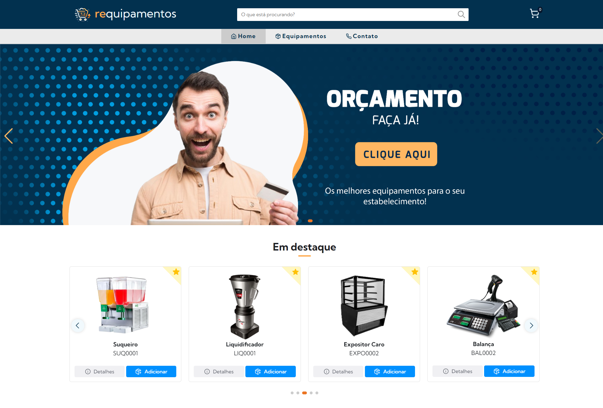

# REQUIPAMENTOS - Simplificando suas Compras de Equipamentos

Bem-vindo ao REQUIPAMENTOS, aqui você encontra os melhores equipamentos para o seu estabelecimento!



## Sobre o Projeto

REQUIPAMENTOS é uma aplicação web projetada para simplificar sua experiência de compra de equipamentos. Navegue por uma ampla seleção de produtos, adicione-os ao seu carrinho e entre em contato conosco para quaisquer dúvidas ou solicitações.

## Acesse o Projeto
```
https://requipamentos.netlify.app/
```
## Recursos

- Navegação Intuitiva: Encontre facilmente os equipamentos que procura.
- Gerenciamento de Carrinho: Adicione e ajuste itens no seu carrinho com facilidade.
- Contato Simples: Entre em contato conosco para quaisquer dúvidas ou consultas.
- Persistência de Dados: Seu carrinho é armazenado localmente para fácil acesso posterior.

## Tecnologias Utilizadas

- [React](https://reactjs.org/): Biblioteca JavaScript para construir interfaces de usuário.
- [React Router](https://reactrouter.com/): Roteamento de URL para aplicativos React.
- [Lucide Icons](https://lucide.dev/): Conjunto de ícones SVG para a interface do usuário.
- [Radix UI](https://radix-ui.com/): Componentes de interface do usuário acessíveis para React.
- [EmailJS](https://www.emailjs.com/): Serviço de envio de e-mails fácil de usar para formulários de contato.

---

Com REQUIPAMENTOS, sua jornada de compras de equipamentos será mais simples e eficiente. Experimente agora e tenha uma experiência de compra sem complicações! 🛒✨